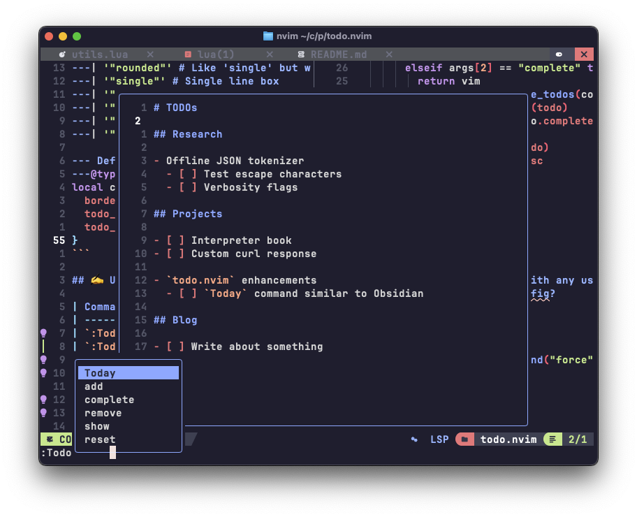

# `todo.nvim` 📔

A minimal TODO scratch buffer for jotting down quick notes.

<div align="center">
    
</div>

## 📦 Installation

**[lazy.nvim](https://github.com/folke/lazy.nvim)**:

```lua
{
    "micahkepe/todo.nvim",
    cmd = "Todo",

    ---@type todo-nvim.Config
    opts = {
        -- optional default overrides here
    }

    -- Optionally, uncomment the following to set `<leader>td` to open the
    -- buffer
    -- keys = {
    --   { "<leader>td", ":Todo<CR>", mode = "n", { desc = "Open Todos scratch file" },
    --   },
    -- },
}
```

## ⚙️ Configuration

Default configuration:

```lua
---@class todo-nvim.Config
---@field todo_file string the path to the file to modify
---@alias border string
---| '"rounded"' # Like 'single' but with rounded corners
---| '"single"' # Single line box
---| '"double"' # Double line box
---| '"solid"' # Adds padding by a single whitespace cell
---| '"none"' # No border
---| '"shadow"' # Drop shadow effect with background

--- Default configurations
---@type todo-nvim.Config
local config = {
  border = "rounded",
  todo_file = vim.fn.stdpath("data") .. "/todos.md",
}
```

## ✍️ Usage

| Command                                       | Lua API                      | Description                                               | Completions |
| --------------------------------------------- | ---------------------------- | --------------------------------------------------------- | ----------- |
| `:Todo`                                       | `require("todo").toggle()`   | Toggles the TODO buffer open/close                        | ✅          |
| `:Todo add <desc>`                            | `require("todo").add()`      | Add TODO item to list                                     | ❌          |
| `:Todo remove <desc>`                         | `require("todo").remove()`   | Remote TODO item to list                                  | ✅          |
| `:Todo complete <desc>`                       | `require("todo").complete()` | Mark the item with the given description as complete      | ✅          |
| `:Todo show [completed \| incomplete \| all]` | `require("todo").show()`     | Notification list of TODOs, optionally filtering by state | ✅          |
| `:Todo reset`                                 | `require("todo").reset()`    | Clears all TODOs from the file                            | ❌          |

The TODO buffer can be closed by pressing `q` inside the floating window.

## 🗺️ TODOs

(meta, I know)

- [x] Floating window for TODO file
- [x] Clear/reset TODOs
- [x] Mark as done/ archive
- [x] Add new items from the command line
- [ ] Enhanced buffer styling + advanced configuration options
- [ ] Async/ deferred functions for active TODO buffer
- [ ] Testing

---

## Contributing

Pull requests welcome! If you have a feature or suggestion, feel free to open
an issue or a pull request, I would be happy to review and merge any
contributions.

---

## License

This repository is licensed under the MIT License. See [LICENSE](./LICENSE) for
more details.
